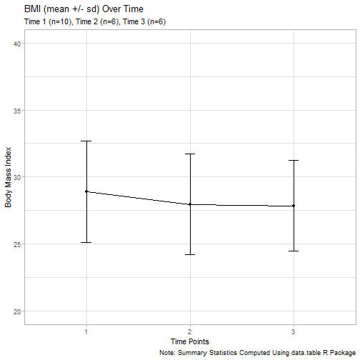

```r
# Load packages =================================
library(dplyr)
library(readr)

# READ IN LONG Dataset ==========================
# Each person has from 1 - 3 time points
# time nested within id
# importing required libraries
long1 <- read_csv("long1.csv")
```

```
## Rows: 22 Columns: 4
## ── Column specification ──────────────────────────────────────────────────
## Delimiter: ","
## dbl (4): id, time, bmi, satis
## 
## ℹ Use `spec()` to retrieve the full column specification for this data.
## ℹ Specify the column types or set `show_col_types = FALSE` to quiet this message.
```

```r
long1
```

```
## # A tibble: 22 × 4
##       id  time   bmi satis
##    <dbl> <dbl> <dbl> <dbl>
##  1     1     1  28       6
##  2     1     2  27.6     7
##  3     1     3  27.4     8
##  4     2     1  33.4     7
##  5     2     2  33.5     7
##  6     2     3  33.2     6
##  7     3     1  23.4     8
##  8     3     2  23.3     9
##  9     3     3  24.5     8
## 10     4     1  25.6     6
## # ℹ 12 more rows
```

```r
# see who is missing which time point
with(long1, table(id, time))
```

```
##     time
## id   1 2 3
##   1  1 1 1
##   2  1 1 1
##   3  1 1 1
##   4  1 0 1
##   5  1 0 0
##   6  1 1 1
##   7  1 0 0
##   8  1 0 0
##   9  1 1 0
##   10 1 1 1
```

```r
# time points per id
with(long1, table(id))
```

```
## id
##  1  2  3  4  5  6  7  8  9 10 
##  3  3  3  2  1  3  1  1  2  3
```

```r
# subjects per time point
with(long1, table(time))
```

```
## time
##  1  2  3 
## 10  6  6
```

```r
# BASE R aggregate() function ===================
# get mean bmi's and mean statisfaction scores
# within each time point
aggregate(cbind(bmi, satis) ~ time, 
          data = long1, 
          FUN = mean)
```

```
##   time   bmi    satis
## 1    1 28.91 6.900000
## 2    2 27.95 7.500000
## 3    3 27.85 7.833333
```

```r
# More Powerful data.table package ==============
# https://rdatatable.gitlab.io/data.table/
# load package
library(data.table)

# convert long1 from data.frame to data.table class
long1.dt <- data.table(long1)
class(long1)
```

```
## [1] "spec_tbl_df" "tbl_df"      "tbl"         "data.frame"
```

```r
class(long1.dt)
```

```
## [1] "data.table" "data.frame"
```

```r
# dt[any filters,
#    functions to apply,
#    by which variables (aggregate within)]

# for id's 1-5
# get sample size and mean bmi and mean satis
# within each time point
ans <- long1.dt[id < 6,
               .(.N, mean(bmi), mean(satis)),
               by = .(time)]
ans
```

```
##     time     N       V2       V3
##    <num> <int>    <num>    <num>
## 1:     1     5 27.88000 6.400000
## 2:     2     3 28.13333 7.666667
## 3:     3     4 27.92500 7.500000
```

```r
# example use for making an
# error bar plot
bmi_by_time <-
  long1.dt[,                  # no row filter used
           .(mean(bmi),       # list functions
             sd(bmi)),
           by = .(time)]      # aggregate by
bmi_by_time
```

```
##     time    V1       V2
##    <num> <num>    <num>
## 1:     1 28.91 3.786071
## 2:     2 27.95 3.756993
## 3:     3 27.85 3.386296
```

```r
# clean up variable names
names(bmi_by_time)
```

```
## [1] "time" "V1"   "V2"
```

```r
names(bmi_by_time) <- c("time", "bmi", "sd")
names(bmi_by_time)
```

```
## [1] "time" "bmi"  "sd"
```

```r
library(ggplot2)

# make error bar plot
# see http://www.cookbook-r.com/Graphs/Plotting_means_and_error_bars_(ggplot2)/
# mean bmi +/- sd at each time point
# options added to plot
# set y-axis limits
# remove 0.5 time point labels and tick marks - see http://www.sthda.com/english/wiki/ggplot2-axis-ticks-a-guide-to-customize-tick-marks-and-labels
# try different themes
# add nicer labels, titles and a caption

ggplot(bmi_by_time, 
       aes(x=time, y=bmi)) + 
  geom_errorbar(aes(ymin=bmi-sd, ymax=bmi+sd), width=.1) +
  geom_line() +
  geom_point() +
  ylim(20, 40) +
  scale_x_discrete(limits=c("1","2","3")) +
  #theme_classic() +
  #theme_linedraw() +
  theme_light() +
  labs(
    x = "Time Points",
    y = "Body Mass Index",
    title = "BMI (mean +/- sd) Over Time",
    subtitle = "Time 1 (n=10), Time 2 (n=6), Time 3 (n=6)",
    caption = "Note: Summary Statistics Computed Using data.table R Package"
  )
```



```r
# Note You can "knit" the R script to markdown and HTML
# knitr::spin("aggregate.R", format = "Rmd")
# this creates
#      aggregate.md
#      aggregate.html
```

